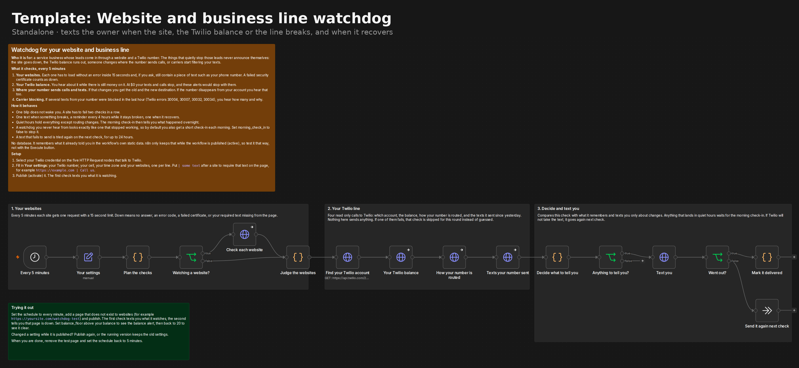

# Website and business line watchdog

A standalone n8n workflow that watches the things that quietly stop a service business's leads, and texts the owner when one of them changes:

- the website goes down, or loads without something that has to be on it
- the Twilio balance runs low
- the business number stops sending calls or texts where it did, or disappears from the account
- carriers start blocking the number's texts

It needs n8n and a Twilio account. No database, no CRM, no community nodes, no AI model.

## The business problem

Leads come in through two doors: the website and the phone number. Both can stop working without anyone noticing. The site goes down on a Friday night. The Twilio balance runs out and texts stop going out. Someone changes where the number sends calls. Carriers start filtering the business's texts as spam. None of that sends the owner a message. The owner finds out when the phone has been quiet for three days.

## What it checks, every 5 minutes

1. **Websites.** Each one has to load without an error inside 15 seconds. You can also give it a piece of text that must be on the page, such as your phone number. A page that loads but has lost your number counts as down. A failed security certificate counts as down.
2. **Twilio balance.** It warns you while there is still money on the account, at a floor you choose. At $0 Twilio stops your texts and calls, and it would stop these alerts too.
3. **Where the number sends calls and texts.** The first check remembers the destination (a webhook URL, a TwiML app or a SIP trunk). If it changes you get the old and the new one. If the number is no longer on the account, you hear about it at once, even at night.
4. **Carrier blocking.** It reads the texts the number sent in the last hour and counts the ones carriers refused: Twilio errors 30004 (blocked), 30007 (carrier filtering), 30032 (toll-free number not verified) and 30034 (number not registered for A2P 10DLC). A wrong number or a landline is left out, because that is one bad number, not a problem with your line. So are the watchdog's own texts to you.

Every call to Twilio is a read, apart from the text to you. It never changes anything on your account.

## What the owner gets

- **On the first check**, one text saying what it watches and where things stand right now.
- **When something breaks**, one text. A website has to fail two checks in a row first, so one blip does not wake you up.
- **While it stays broken**, a reminder every 4 hours, with how long it has been down.
- **When it recovers**, one text, with how long it was down.
- **In quiet hours** (9 PM to 7 AM by default) everything is held except routing changes and a missing number. The morning check-in then says what happened overnight and where things stand.
- **Every morning**, a short check-in even when nothing broke, because a watchdog you never hear from looks exactly like one that stopped working. Switch it off with `morning_check_in`.
- **If Twilio refuses one of these texts**, it is kept and sent again on the next check, for up to 24 hours.

Several things at once arrive as one text with a line each. [examples/owner-texts.md](examples/owner-texts.md) has the texts it sends, including real ones from the live test.

## Requirements

- n8n Cloud or self-hosted n8n. Tested on n8n Cloud and on n8n 2.40.5.
- Core nodes only: Schedule Trigger, Set, Code, If, HTTP Request and No Operation.
- A Twilio account, the business number on that account, and a Twilio credential in n8n.
- A number that can text the owner's cell. In the US that means A2P 10DLC registration, or a verified toll-free number.

## Install

1. Import [`workflow/website-and-line-watchdog-sms.json`](workflow/website-and-line-watchdog-sms.json) into n8n.
2. Select your Twilio credential on the five HTTP Request nodes that talk to Twilio: **Find your Twilio account**, **Your Twilio balance**, **How your number is routed**, **Texts your number sent** and **Text you**.
3. Fill in **Your settings** (below).
4. Publish it. The first check texts you what it is watching.

It will not run with the example phone numbers still in. The run stops in red in n8n and says why.

## Settings

| Setting | Default | What it does |
| --- | --- | --- |
| `business_name` | `Your Business` | Used in the first text |
| `business_number` | `+15555550100` | Your Twilio number. The texts come from it and its routing is watched |
| `owner_cell` | `+15555550199` | Where the texts go |
| `timezone` | `America/New_York` | For quiet hours and the times in the texts |
| `websites` | `https://www.example.com` | One per line. Add `\| text` after a site to require that text on the page, for example `https://example.com \| Call us`. Lines starting with `#` are ignored. Leave it empty to watch only the line |
| `fails_before_alert` | `2` | Failed checks in a row before a site counts as down |
| `remind_every_hours` | `4` | Reminder while something stays broken. `0` turns reminders off |
| `balance_floor` | `20` | Alert when the Twilio balance drops under this. `0` turns the check off |
| `block_window_minutes` | `60` | How far back the carrier blocking check looks |
| `block_alert_count` | `3` | Blocked texts in that window before you hear about it. `0` turns the check off |
| `quiet_start`, `quiet_end` | `21:00`, `07:00` | Alerts are held between these. The same value for both means no quiet hours. `quiet_end` is also the time of the morning check-in |
| `routing_alerts_at_night` | `true` | Routing changes still text you in quiet hours |
| `morning_check_in` | `true` | A short text each morning even when nothing broke |

The check interval is on the **Every 5 minutes** node.

## Trying it out

Use your own phone and your own site.

1. Set the schedule to every minute.
2. Add a page that does not exist, for example `https://yoursite.com/watchdog-test`, to `websites`, and publish.
3. The first check texts you what it watches. The second tells you that page is down with a 404.
4. Set `balance_floor` above your balance to see the balance alert, then back to `20` to see it clear.
5. Remove the test page and set the schedule back to 5 minutes.

On n8n 2.x, a change to a published workflow does not reach the running copy until you publish again. If a test seems to ignore your edit, that is why.

Do not test a routing change on a live business number. That part was tested against a mock Twilio API instead (see below).

## Tests

- [`tests/watchdog.test.js`](tests/watchdog.test.js) runs the Code node source straight out of the workflow file, with n8n's globals stubbed and the clock frozen: 63 checks, including quiet hours, the morning check-in, reminders, the 24 hour limit on retries, certificate and DNS failures, and that the file ships with no credentials and the example numbers. `cd tests && npm install && node watchdog.test.js`. CI runs it on every push.
- [`docs/VERIFIED-RESULTS.md`](docs/VERIFIED-RESULTS.md) has every live run on n8n Cloud against a real website and a real Twilio number, and the runs against a mock Twilio API in a local n8n.
- [`docs/DECISIONS.md`](docs/DECISIONS.md) explains the design choices.

## What is not covered

- The morning check-in was not seen live. It needs a new day, and n8n does not let a workflow's stored memory be changed from outside. It is covered by the automated checks.
- A real routing change, a number leaving the account and real carrier blocking were only simulated.
- An expired certificate and a DNS failure against a real site were only covered by the automated checks. A timeout was real, in a local n8n.

## Limits

- **Memory needs a published workflow.** It remembers what it already told you in n8n's workflow static data, which n8n keeps only for published workflows. A run started with the Execute button does not keep it, so every such run looks like a first run.
- **At $0 it cannot text you either.** The alerts go through the same Twilio account. That is why it warns at a floor.
- **It checks from n8n's servers.** A site that is up for n8n but down for some visitors is not caught. A site behind a bot challenge may answer n8n with an error and look down.
- **Certificates are caught when they fail**, not days before they expire.
- **Messaging Services.** If the number sits in a Twilio Messaging Service, incoming texts follow the service's settings, which it does not read.
- **One number per workflow.** Duplicate it for a second number.
- **Subaccounts.** It uses the first active account the credential returns. If your credential can see subaccounts, use one for the account that owns the number.

## License

MIT. Use it, change it, sell it.

Built by [Mike Matthews](https://github.com/mikematthewsai). More standalone workflows and the full lead-response system: [n8n-lead-response](https://github.com/mikematthewsai/n8n-lead-response).
